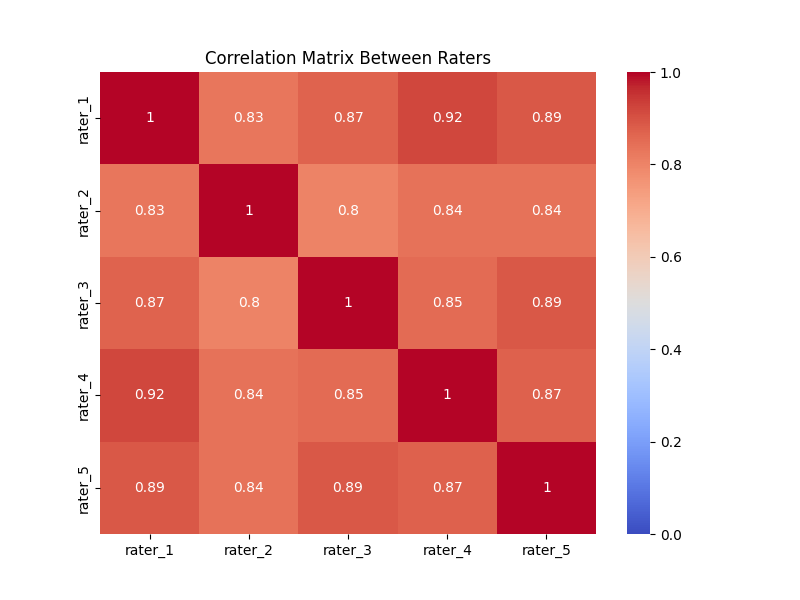
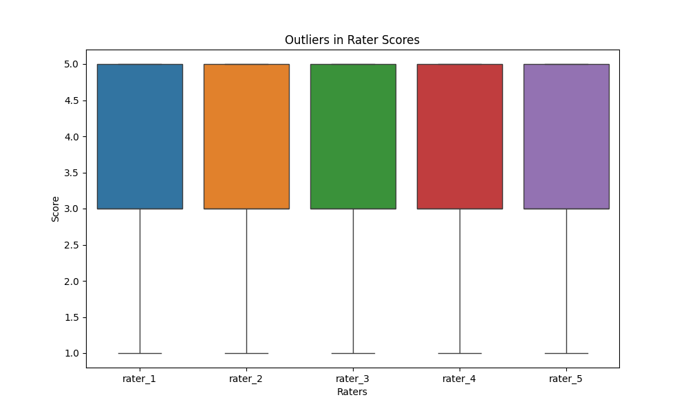
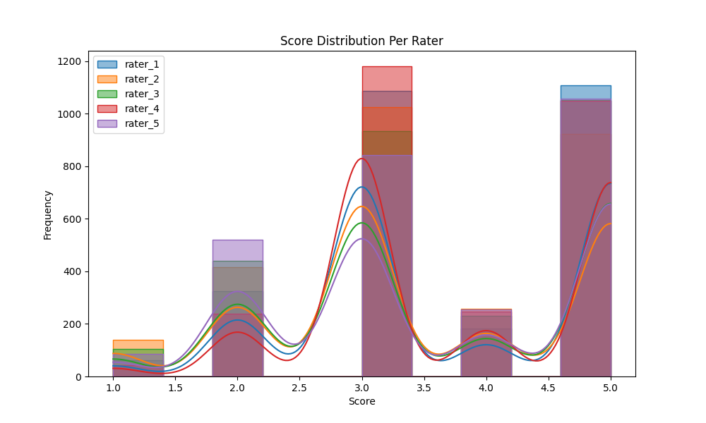
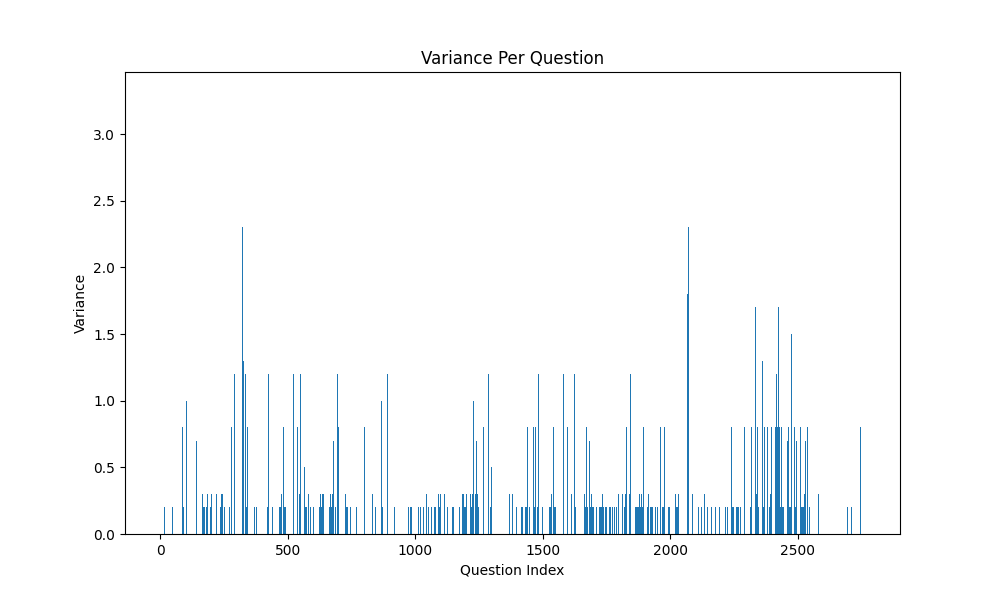

# eLOK Dataset

## Overview

The **eLOK Dataset** is collected from a Learning Management System (LMS) named **eLOK**, which is used by **Gadjah Mada University** for course management and online learning activities. This dataset specifically contains student responses to both mid-term and final-term exams for the **Digital Transformation Course**.

The dataset provides insights into the assessment process where **five raters** evaluated the student answers. The consistency between the raters was measured using the **Quadratic Weighted Kappa (QWK)** score, which evaluates the agreement between raters.

## Dataset Summary

- **Total Questions**: 15
- **Total Student Responses**: 2763
- **Number of Raters**: 5
- **Course**: Digital Transformation Course
- **Institution**: Gadjah Mada University

## Quadratic Weighted Kappa (QWK) Scores

The QWK scores reflect the agreement between each pair of raters. The higher the QWK score, the higher the level of agreement.

- **QWK between Rater 1 and Rater 2**: 0.8183
- **QWK between Rater 1 and Rater 3**: 0.8629
- **QWK between Rater 1 and Rater 4**: 0.9180
- **QWK between Rater 1 and Rater 5**: 0.8829
- **QWK between Rater 2 and Rater 3**: 0.7987
- **QWK between Rater 2 and Rater 4**: 0.8172
- **QWK between Rater 2 and Rater 5**: 0.8355
- **QWK between Rater 3 and Rater 4**: 0.8436
- **QWK between Rater 3 and Rater 5**: 0.8904
- **QWK between Rater 4 and Rater 5**: 0.8627

- **Average QWK across all raters**: 0.8530

## Visualizations

### 1. Correlation Matrix Between Raters

The correlation matrix shows the correlation scores between the raters. A higher correlation indicates similar scoring patterns between raters.

### 2. Outliers in Rater Scores

This boxplot shows the distribution of scores given by each rater, helping to identify outliers. The consistency in boxplot shapes indicates that the raters have similar scoring patterns.

### 3. Score Distribution Per Rater

The histogram with KDE (Kernel Density Estimate) overlays shows the distribution of scores given by each rater. It reveals that most scores are concentrated around 2, 3, and 5.

### 4. Variance Per Question

This bar plot visualizes the variance in scores for each question across all raters. Higher variance indicates less agreement among raters for that specific question.

## Attributes of the Dataset

The dataset contains the following attributes:

1. **no**: The question number or identifier.
2. **key**: A unique identifier for the student response.
3. **question_key**: The identifier for the specific question.
4. **subject**: The subject or type of the assessment (e.g., mid-terms or final-terms).
5. **answer**: The student’s response to the question.
6. **rater_1**: The score provided by the first rater.
7. **rater_2**: The score provided by the second rater.
8. **rater_3**: The score provided by the third rater.
9. **rater_4**: The score provided by the fourth rater.
10. **rater_5**: The score provided by the fifth rater.

## Files

The dataset consists of the following files:
1. **answers.csv**: Contains the student responses and the scores given by the five raters.
2. **questions.csv**: Contains the details of the questions used in the mid-term and final-term exams.
